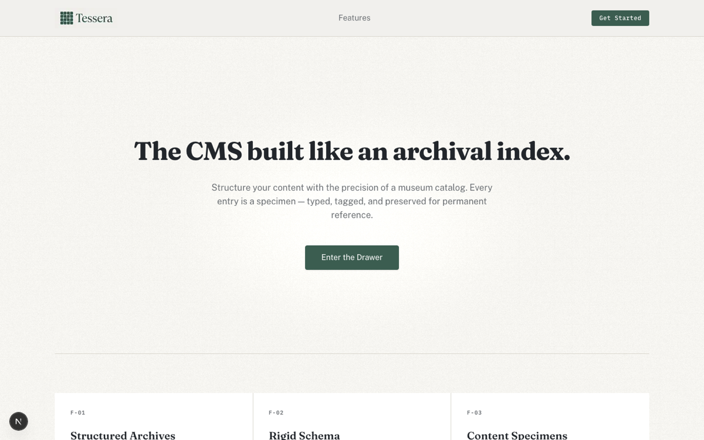
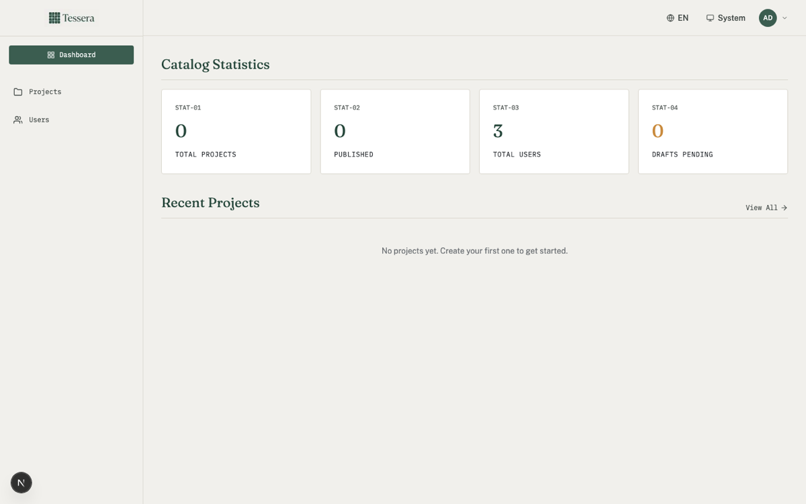
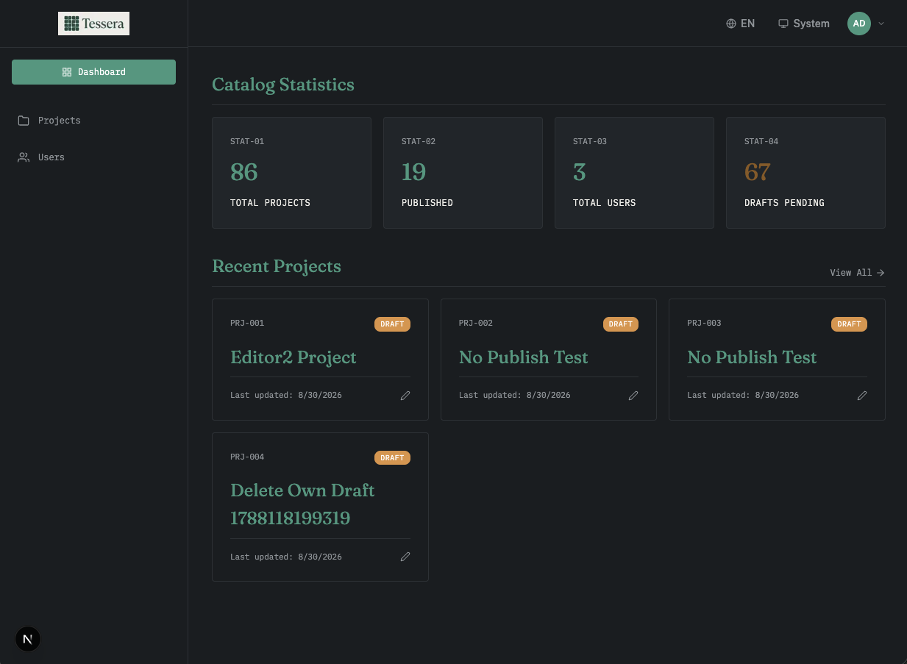
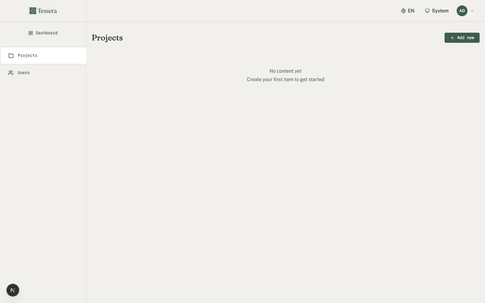
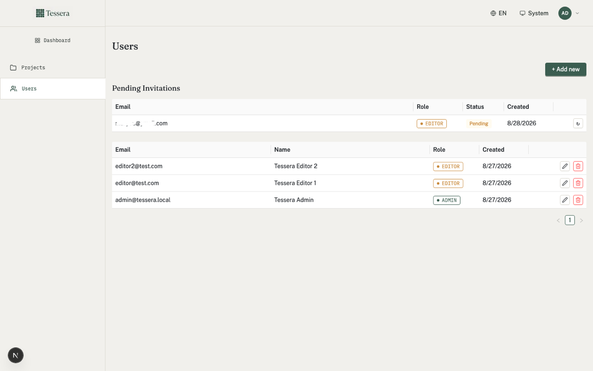

<div align="center">


# Tessera
🚧 under-construction

**Structured content, one piece at a time.**

A lightweight, bilingual (EN/AR) content management system with a GraphQL API, dual-themed admin console, and a public content catalog.

[](https://github.com/your-org/tessera/actions)
[](./LICENSE)
[](./CONTRIBUTING.md)

</div>

---

## What it is today

A working mini CMS for managing projects, posts, and testimonials — create, edit, publish, and query content through a clean admin UI backed by a self-documenting GraphQL API.

## Where it's going

Tessera is actively evolving toward a full-featured headless CMS with workflows, roles, content scheduling, media management, and multi-tenant support. This repo is the foundation — everything built here is designed to scale up, not throw away. See the [Roadmap](#roadmap) for details.

---

## Features

| Feature               | Description                                                                             |
| --------------------- | --------------------------------------------------------------------------------------- |
| **Admin Console**     | Session-gated dashboard for content CRUD (projects, posts, testimonials, users)         |
| **GraphQL API**       | Apollo Server 5 at `/api/graphql` with introspection, rate limiting, and depth limiting |
| **Bilingual Support** | English and Arabic with RTL-aware layouts                                               |
| **Dual Themes**       | Light and dark mode, persisted per user                                                 |
| **User Management**   | Invite-based onboarding, role-based access (Admin, Editor, Viewer)                      |
| **AI Draft Assist**   | Optional OpenRouter-powered content generation (feature-flagged)                        |
| **Public Catalog**    | Browsable content pages with locale-aware rendering                                     |

---

## Screenshots

<div align="center">



_Public landing page — light mode_

</div>

<div align="center">



_Admin dashboard with session-gated navigation_

</div>

<div align="center">



_Admin dashboard dark_

</div>

<div align="center">



_Projects catalog with status badges and locale support_

</div>

<div align="center">



_User management with invite-based onboarding_

</div>

<div align="center">

https://github.com/user-attachments/assets/434477a2-2318-45db-a552-1bf71d45c1d2

_Ai Draft Assistance_

</div>


---

## Quick Start

```bash
# Clone and install
git clone <repo-url> && cd tessera
npm install

# Set up environment
cp .env.example .env.local
# Fill in DATABASE_URL, BETTER_AUTH_SECRET, GITHUB_CLIENT_ID/SECRET
# OPENROUTER_API_KEY (optional, enables AI draft assist)

# Generate Prisma client + run migrations
npx prisma generate
npx prisma migrate dev

# Seed the admin user
npx tsx prisma/seed.ts

# Start development
npm run dev
# → http://localhost:3000
```

---

## Tech Stack

<div align="left">

|     Layer     | Technology                                  |
| :-----------: | ------------------------------------------- |
| **Framework** | Next.js 15 (App Router, React 19, RSC)      |
| **Database**  | PostgreSQL (Neon) via Prisma ORM            |
|   **Auth**    | Better Auth (email/password + GitHub OAuth) |
|    **API**    | Apollo Server 5 (GraphQL, schema-first)     |
|    **UI**     | Ant Design 5 + Tailwind CSS 4               |
|    **AI**     | OpenRouter (feature-flagged draft assist)   |
|  **Testing**  | Vitest + Playwright + axe-core              |
|   **CI/CD**   | GitHub Actions                              |

</div>

---

## Scripts

| Command                   | Purpose                                                 |
| ------------------------- | ------------------------------------------------------- |
| `npm run dev`             | Next.js dev server (port 3000)                          |
| `npm run build`           | Production build                                        |
| `npm run start`           | Serve production build                                  |
| `npm run typecheck`       | `tsc --noEmit`                                          |
| `npm run lint`            | ESLint                                                  |
| `npm run test`            | Vitest unit/integration tests                           |
| `npm run test:e2e`        | Playwright e2e (requires `npm run start` in background) |
| `npm run storybook`       | Storybook dev server (port 6006)                        |
| `npm run build-storybook` | Static Storybook build                                  |

---

## Environment Variables

All defined in `.env.example` — copy to `.env.local` for local development.

| Variable                  | Required | Description                                           |
| ------------------------- | :------: | ----------------------------------------------------- |
| `DATABASE_URL`            |    ✓     | Neon Postgres pooled connection string                |
| `BETTER_AUTH_SECRET`      |    ✓     | Secret for Better Auth session signing                |
| `GITHUB_CLIENT_ID`        |    ✓     | GitHub OAuth app client ID                            |
| `GITHUB_CLIENT_SECRET`    |    ✓     | GitHub OAuth app client secret                        |
| `BETTER_AUTH_URL`         |          | Auth base URL (defaults to `http://localhost:3000`)   |
| `OPENROUTER_API_KEY`      |          | OpenRouter API key for AI draft assist                |
| `OPENROUTER_MODEL`        |          | Model ID (default: `openrouter/free`)                 |
| `FEATURE_AI_DRAFT_ASSIST` |          | Enable AI draft assist in dev (`true`/`false`)        |
| `NEXT_PUBLIC_APP_URL`     |          | Public site URL (defaults to `http://localhost:3000`) |
| `SEED_ADMIN_EMAIL`        |          | Admin email seeded by `prisma/seed.ts`                |

---

## Architecture

```
app/
  [locale]/
    (public)/        — public routes (schema page, catalog)
    (admin)/         — session-gated admin console
  api/
    auth/[...all]/   — Better Auth handler
    graphql/         — Apollo Server (schema-first, rate-limited)
    user/            — user preferences (locale/theme persistence)
components/
  ui/                — shared primitives (StatusBadge, CatalogCard)
  admin/             — admin-only (ContentForm, ContentTable)
  landing/           — public landing page components
lib/
  auth/              — session helpers, RBAC
  ai-draft-assist/   — OpenRouter integration (feature-flagged)
  graphql-schema/    — typeDefs, resolvers, auth guard
  theme/             — design tokens, Ant Design theme builder
  content/           — content service (localized field resolution)
styles/
  tokens.scss        — single source of truth for all design tokens
```

---

## Design System

See [`DESIGN.md`](./DESIGN.md) for the full visual specification. Tokens live in
`styles/tokens.scss` and are consumed by Tailwind (`tailwind.config.ts`) and Ant Design
(`lib/theme/antd-theme.ts`) — never hardcoded in components.

---

## Roadmap

Tessera is under active development. Here's what's planned as it evolves from a mini CMS into a full content platform:

- [ ] Rich text editor for content fields
- [ ] Media/image uploads with CDN storage
- [ ] Content scheduling and draft workflows
- [ ] Multi-tenant organization support
- [ ] Webhook integrations (Zapier, Slack, etc.)
- [ ] REST API alongside GraphQL
- [ ] Content versioning and audit log
- [ ] Plugin system for custom content types

---

## Testing

Tests follow test-first development (red → green → refactor):

- **Unit/integration:** `vitest` — `npm run test`
- **E2E:** `@playwright/test` — 4 locale×theme combinations, run against production build
- **A11y:** `@axe-core/playwright` — serious/critical violations fail the build
- **Design-token audit** — ensures no raw hex or AntD defaults leak into components
- **Storybook:** living component gallery with theme/locale toolbar — `npm run storybook`

---

## CI

`.github/workflows/ci.yml` runs on every push/PR to `main`:

1. Typecheck · Lint · Unit tests (parallel)
2. Design-token audit
3. Playwright e2e (after typecheck + lint)
4. Lighthouse CI — performance ≥ 90 (warn), accessibility/best-practices/seo ≥ 90 (error)
5. GraphQL schema-diff — catches breaking changes against committed baseline
6. Storybook build — ensures stories compile

---

## Contributing

See [`CONTRIBUTING.md`](./CONTRIBUTING.md) for setup instructions, development workflow, and project conventions.

---

<div align="left">

## License

MIT — see [`LICENSE`](./LICENSE) for details.

</div>
